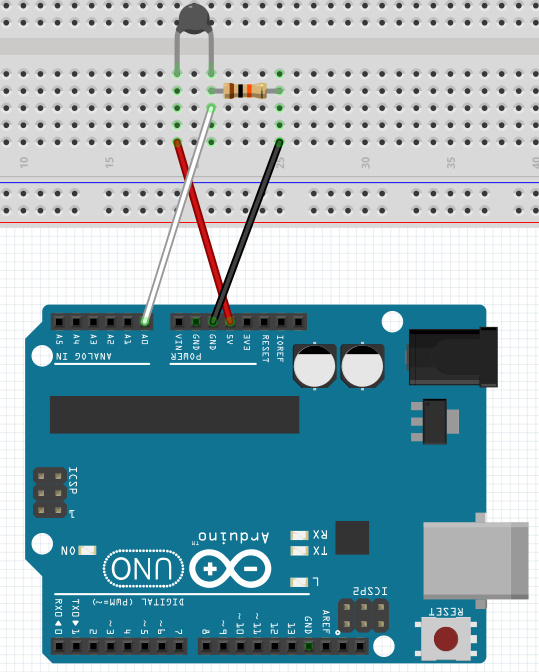
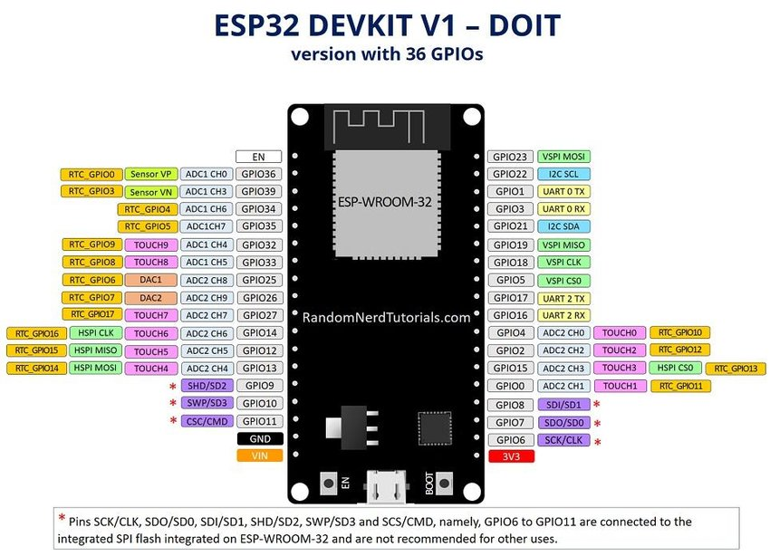

# Thermometer mit einem Thermistor
[Link zur Präsentation](https://mnlmrngl.github.io/FundmentalsOfIOT/Thermometer%20with%20termistor/Thermoelektrische%20Wandler_v04_final.pdf)

## 1. Code in VS Code laden
Damit ihr das Beispiel benutzen könnt, müsst ihr den Ordner "Code" al Projekt über PlatformIO öffen.  
## 2. Variablen anpassen
Als nächstes müsst ihr die Variablen anpassen. Im Code steht beschrieben, welche Variable für was zuständig ist.
## 3. Hardware verbinden
Jetzt müsst ihr alles wie auf dem Bild gzeigt verkabeln. Das ist eine Spannungsteiler.  
Thermisor (bei 25°C) und Widerstand müssen den gleichen Wert haben, sonst bekommt ihr ungenaue Werte.

Ich habe einen Arduino im Schaltplan benutzt.  
5V  ->  Ein anderer PIN als GND wählen und als OUTPUT und HIGH definieren  
A0  ->  analoger Input-Pin am ESP (gegennzeichnet im Datenblatt als ADCx) ationls INPUT definieren  
GND -> GND

 

## 4. Upload
Zum Schluss noch auf den ESP laden. Viel Spaß!

